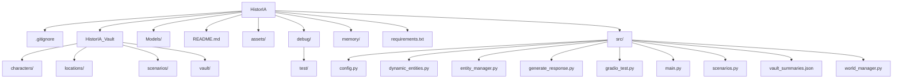

# HistorIA

**HistorIA** is an AI-powered interactive narrative simulator and storytelling assistant.  
It allows the user to control the main character while the AI manages all secondary characters, dynamically generating dialogue, actions, reactions, and world events in real-time.

---

## Features

- **Human-Controlled Protagonist:** The player controls the main character (Master).  
- **AI-Driven Secondary Characters:** All other characters act autonomously, with dialogue, gestures, emotions, and reactions.  
- **Dynamic World & Story:** Characters and locations evolve over time; relationships, moods, and statuses are tracked.  
- **Persistent Progress:** World state and character files are saved in Markdown and JSON, allowing stories to continue across sessions.  
- **Interactive Interface:** Built with Gradio for live chat interactions.  
- **Special Features:** Night mode, dynamic abilities, outfit management, and AI-only interactions between secondary characters.

---

## Project Structure



HistorIA
├─ .gitignore
├─ HistorIA_Vault
│  ├─ characters/
│  ├─ locations/
│  ├─ scenarios/
│  └─ vault/
├─ Models/
├─ README.md
├─ assets/
├─ debug/
│  └─ test/
├─ memory/
├─ requirements.txt
└─ src/
   ├─ config.py
   ├─ dynamic_entities.py
   ├─ entity_manager.py
   ├─ generate_response.py
   ├─ gradio_test.py
   ├─ main.py
   ├─ scenarios.py
   ├─ vault_summaries.json
   └─ world_manager.py

---

## Installation

1. **Clone the repository:**

```bash
git clone https://github.com/SkinMaker5/HistorIA.git
cd HistorIA
Create and activate a virtual environment:

bash
Copiar código
python -m venv venv
# Windows
venv\Scripts\activate
# macOS/Linux
source venv/bin/activate
Install dependencies:

bash
Copiar código
pip install -r requirements.txt
Usage
Run the main script to start the interactive story:

bash
Copiar código
python main.py
Interact with the protagonist in the Gradio chat interface.

Use special commands for character management:

/addnote → Add notes to a character

/list → List active characters

The AI will generate dynamic narrative, dialogue, and reactions for all secondary characters.

Contribution
Contributions are welcome! Suggested improvements:

Add more scenarios and modular locations

Implement unit tests for core functions

Enhance AI narrative prompts for richer storytelling

License
This project is open-source under the MIT License.

Enjoy building immersive stories with HistorIA!